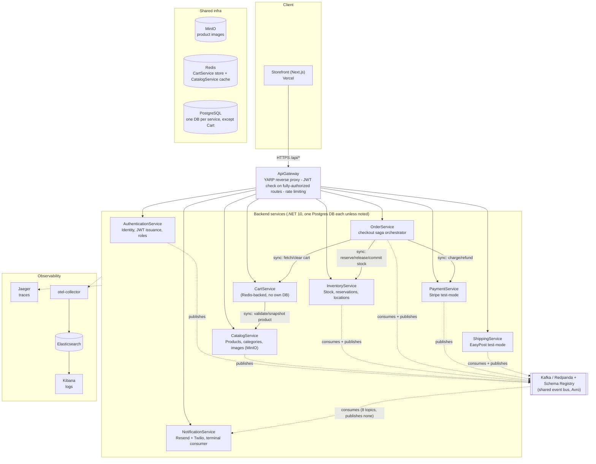
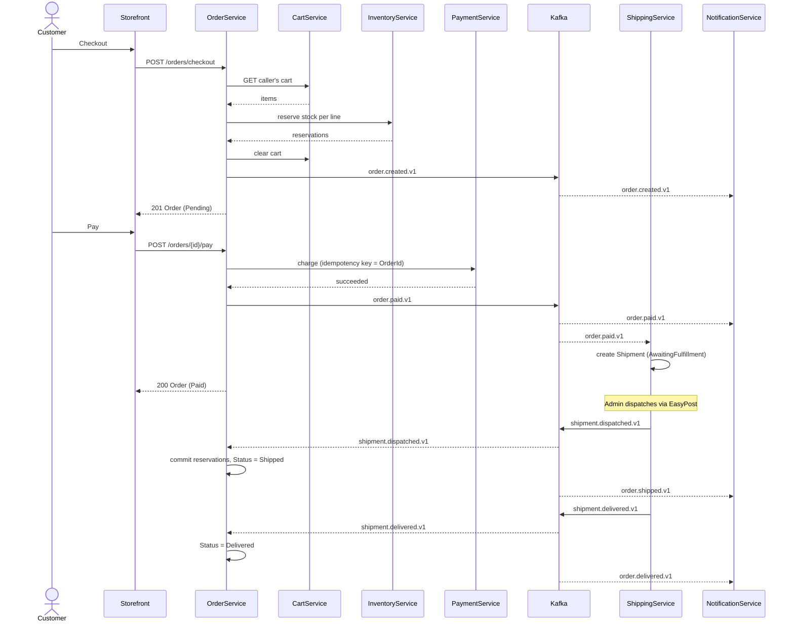

# CommerceCore

[](LICENSE)

Ecommerce microservices platform. Each service lives in its own top-level folder in this repo (one repo, one service per subfolder), built one service at a time.

**Live demo:** [commercecore.app](https://commercecore.app) – Storefront on Vercel, backend on a
single Oracle Cloud VM (see [deploy/README.md](deploy/README.md)). NotificationService is the only
service not deployed there (it needs your own Resend/Twilio credentials and nothing in the
Storefront calls it directly, so its absence doesn't break anything).

## Architecture



Solid arrows are synchronous HTTP calls; dashed arrows and the Kafka node are asynchronous. The
gateway is the only backend service reachable from outside the Docker network – see
[Services](#services) below for what each box actually does, and
[Observability](#observability) for the traces/logs side in more detail.

### Checkout → payment → fulfillment → notification

The order lifecycle is the one flow that touches nearly every service, mixing synchronous calls
(checkout, pay) with asynchronous Kafka hops (everything from "paid" onward) – see
[OrderService/README.md](OrderService/README.md#order-lifecycle) for the full state machine this
implements:



## Stack

- .NET 10, Clean Architecture per service (Domain / Application / Infrastructure / Api), CQRS via MediatR
- Confluent Kafka + Schema Registry (Avro) as the shared event bus – one broker/registry for the whole platform, each service owns its own topics
- MinIO (S3-compatible) as shared object storage – one instance for the whole platform, each service gets its own bucket(s)
- Redis as shared infra – one instance for the whole platform; used as a cache by CatalogService and as the **primary store** for CartService, each service namespacing its own keys
- PostgreSQL, one database per service
- Quartz.NET for background jobs
- OpenTelemetry (.NET SDK) for traces + logs, uniformly instrumented across all 9 services – see
  [Observability](#observability) below

## Services

- [AuthenticationService](AuthenticationService/README.md) – Identity/Auth: JWT issuance, user registration/login, refresh token lifecycle, optional phone number (E.164) collected at registration. Publishes auth.user-registered.v1, consumed by NotificationService
- [CatalogService](CatalogService/README.md) – Products and categories, full CRUD, product images via MinIO, Redis-cached reads, validates JWTs issued by AuthenticationService for writes
- [InventoryService](InventoryService/README.md) – Multi-location stock and reservations, auto-provisioned from CatalogService's product events, validates JWTs issued by AuthenticationService for writes
- [CartService](CartService/README.md) – Guest and authenticated shopping carts backed entirely by Redis, snapshotting product price/name from CatalogService at add-time
- [OrderService](OrderService/README.md) – Checkout saga orchestrator: reserves stock in InventoryService, creates the order, clears the cart, and drives the order lifecycle (Pending → Paid → Shipped → Delivered, plus Cancelled/Refunded). Paid→Shipped→Delivered is event-driven – see ShippingService
- [PaymentService](PaymentService/README.md) – Real Stripe test-mode charges and refunds; called synchronously by OrderService's Pay/Refund transitions. Requires your own free Stripe test-mode secret key (see its README) – never committed to this repo
- [ShippingService](ShippingService/README.md) – Real EasyPost test-mode tracker creation and polling; consumes OrderService's order.paid.v1 to auto-create a shipment, and publishes shipment.dispatched.v1/shipment.delivered.v1 which OrderService consumes to drive its own Paid→Shipped→Delivered transitions. Requires your own free EasyPost test-mode API key (see its README) – never committed to this repo
- [NotificationService](NotificationService/README.md) – Real Resend test-mode emails and Twilio test-mode SMS for the order lifecycle (created/paid/shipped/delivered/cancelled/refunded) and failed payments; a pure terminal consumer across AuthenticationService, OrderService, and PaymentService's topics, publishes nothing itself. Requires your own free Resend API key and Twilio trial credentials (see its README) – never committed to this repo
- [ApiGateway](ApiGateway/README.md) – Single public entry point (YARP reverse proxy) routing `/api/*` to the eight services above by path. Enforces JWT auth itself (401s before proxying) only on the routes whose backend controllers are fully `[Authorize]`-gated (Orders/Payments/Shipments/Notifications); Auth/Catalog/Inventory/Cart routes pass through untouched since those controllers mix anonymous and authorized actions per-endpoint. No database, no Kafka – pure routing, no business logic
- [Storefront](Storefront/README.md) – Customer-facing storefront (Next.js/TypeScript), talking to the ApiGateway (which now has a CORS policy for it). Anonymous product browsing, registration/login with a guest-or-signed-in cart that merges on login, checkout with real Stripe Elements payment, and order history with shipment tracking. Containerized like every other service (own Dockerfile + docker-compose.yml)

## Local development

Shared infra (Kafka + Schema Registry + MinIO + Redis) is started once from the root, before starting any individual service:

```bash
docker compose up -d
```

Then follow the README in whichever service you're working on for its own database/run instructions.

Once every service (and [ApiGateway](ApiGateway/README.md)) is running, the gateway at `http://localhost:8080` is the single front door – `/api/products`, `/api/orders`, etc. all route through it to the right backend, so a client only ever needs to know one base URL. Individual services' host ports below remain directly reachable too (useful for debugging one service in isolation).

| Service | API port | DB port |
|---|---|---|
| ApiGateway | 8080 | – |
| AuthenticationService | 8085 | 5433 |
| CatalogService | 8086 | 5434 |
| CartService | 8087 | – (Redis) |
| InventoryService | 8088 | 5435 |
| OrderService | 8089 | 5436 |
| PaymentService | 8090 | 5437 |
| ShippingService | 8091 | 5438 |
| NotificationService | 8092 | 5439 |

## Observability

Every service (all 8 backends + ApiGateway) is instrumented with the OpenTelemetry .NET SDK –
one unified pipeline, not two separate tools bolted on: the same SDK call captures both traces
and logs, correlated by trace ID. The two signal types go to different backends, each suited to
what it's good at:

- **Traces → [Jaeger](http://localhost:16686)** – every inbound request gets a server span
  (`AddAspNetCoreInstrumentation`), and every outbound call one service makes to another gets a
  client span (`AddHttpClientInstrumentation`) – so the checkout saga
  (OrderService → CartService/InventoryService/PaymentService, ShippingService's async follow-up)
  shows up as one connected distributed trace, not four unrelated ones. YARP's own proxying in
  ApiGateway is instrumented the same way, since it runs on the same HttpClient machinery.
- **Logs → [Kibana](http://localhost:5601)** (backed by Elasticsearch) – every `ILogger` call
  across every service, tagged with `service.name` and (when inside a request) the same trace/span
  IDs the corresponding Jaeger trace has, so a log line and its trace can be cross-referenced.

Architecturally: every service's OTLP exporter sends traces straight to Jaeger (OTLP-native as of
Jaeger 1.35+) and logs to a dedicated `otel-collector` (logs-only pipeline, fans out to
Elasticsearch via the `elasticsearchexporter`) – see [otel-collector-config.yaml](otel-collector-config.yaml).
Traces and logs deliberately don't share a collector hop; Jaeger needs none for its own signal.

Brought up as part of the root `docker compose up -d` alongside Kafka/MinIO/Redis. One thing worth
knowing if you ever touch `otel-collector-config.yaml`: the `elasticsearch-index-init` one-shot
container pre-creates the plain `commercecore-logs` index Elasticsearch writes into – the
collector's exporter 404s on its first write otherwise, since its default mapping mode expects an
OTel-native data stream with ILM templates a bare local Elasticsearch doesn't have.

| Tool | URL | Purpose |
|---|---|---|
| Jaeger UI | http://localhost:16686 | Search/inspect distributed traces |
| Kibana | http://localhost:5601 | Search logs (index pattern: `commercecore-logs`) |
| Elasticsearch | http://localhost:9200 | Raw log storage, not usually browsed directly |

Each service's `appsettings.json` has an `Otel` section (`ServiceName`/`TracesEndpoint`/
`LogsEndpoint`) – empty in every committed file, filled by `appsettings.Development.json` for
local `dotnet run` (`localhost:4317` traces, `localhost:4327` logs) and by each service's own
`docker-compose.yml` for containerized runs (`jaeger:4317`, `otel-collector:4317` – the internal
container ports; only the host-side mappings differ between the two, 4317/4318 for Jaeger and
4327/4328 for the collector, so they don't collide on the host).

## Solution

All services' projects are included in the root [commercecore.slnx](commercecore.slnx):

```bash
dotnet build commercecore.slnx
dotnet test commercecore.slnx
```
